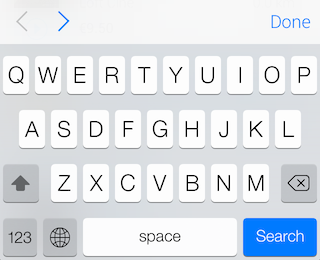

APLKeyboardControls
=========
InputAccesoryView above the keyboard with done button and optional previous and next buttons.

* close the keyboard with a done button
* navigate between UIResponder subclasses like text fields and text views with optional previous and next buttons
* skips hidden inputs
* completely customizable bar button items and toolbar
* looks like the InputAccesoryView in Safari, implemented with iOS 7 in mind

## Installation
Install via cocoapods by adding this to your Podfile:

	pod "APLKeyboardControls", "~> 0.1.0"

## Usage
Import header file:

	#import "APLKeyboardControls.h"
	
Define keyboardControls as a property in your viewController and initialize it like this:
	
	NSArray* inputChain = @[self.textField1, self.textField2, self.textField3];
	self.keyboardControls = [[APLKeyboardControls alloc] initWithInputFields:inputChain];
	self.keyboardControls.hasPreviousNext = YES;

Customize buttons like this:

	self.keyboardControls.doneButton.tintColor = [UIColor redColor];
	
In case you want to use the keyboardControls for other UIResponder subclasses than UITextField and UITextView, for example UISearchBar or a UIButton subclass that can become first responder, send an APLKeyboardControlsInputDidBeginEditingNotification as soon as your subclass becomes first responder, so the keyboardControls get notified about the first responder change.